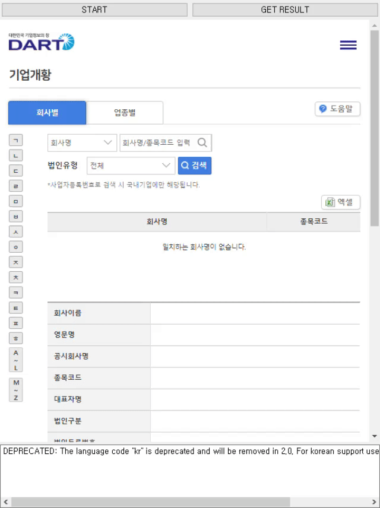

# DARTSectorWebCrawler
Crawling Demo<br>
<br>
UI Viewer Demo<br>
<br>

Language
--
Python (Developed and test with version 3.8.5)

Package Requirements
--
```
PyQt5
PyQtWebEngine<=5.15.3
```

Manual
--
### Crawler
```python
from qtweb_crawling import DartCrawlerWindow
from PyQt5.QtWidgets import QApplication

app = QApplication(sys.argv)
wnd = DartCrawlerWindow()
wnd.resize(600, 800)
wnd.show()
app.exec_()
```
Press 'Start' button to start crawling from DART web-page.<br>
Press 'Get Result' button to serialize crawl result to local file in path {./result_list.pkl}.<br>

### Tree 
You can make tree hierarchy using Tree class.<br>
```python
from tree import Tree
import pickle

with open('./result_list.pkl', 'rb') as fp:
    node_list = pickle.load(fp)
tree = Tree()
tree.add_leaf_nodes(node_list)
```

### UI (Tree & Table Viewer)
```python
import sys
import pickle
from tree import Tree
from treeview import CorpTreeViewWidget
from PyQt5.QtWidgets import QApplication

with open('./result_list.pkl', 'rb') as fp:
    node_list = pickle.load(fp)

app = QApplication(sys.argv)
wgt_ = CorpTreeViewWidget()
wgt_.resize(600, 600)
wgt_.show()
corp_tree = Tree()
corp_tree.add_leaf_nodes(node_list)
wgt_.setCorpTree(corp_tree)
app.exec_()
```

Develop History
--
[웹크롤링 - DART 기업개황 업종별 기업 리스트 가져오기 (1)](https://yogyui.tistory.com/entry/%EC%9B%B9%ED%81%AC%EB%A1%A4%EB%A7%81-DART-%EA%B8%B0%EC%97%85%EA%B0%9C%ED%99%A9-%EC%97%85%EC%A2%85%EB%B3%84-%EA%B8%B0%EC%97%85-%EB%A6%AC%EC%8A%A4%ED%8A%B8-%EA%B0%80%EC%A0%B8%EC%98%A4%EA%B8%B0-1) <br>
[웹크롤링 - DART 기업개황 업종별 기업 리스트 가져오기 (2)](https://yogyui.tistory.com/entry/%EC%9B%B9%ED%81%AC%EB%A1%A4%EB%A7%81-DART-%EA%B8%B0%EC%97%85%EA%B0%9C%ED%99%A9-%EC%97%85%EC%A2%85%EB%B3%84-%EA%B8%B0%EC%97%85-%EB%A6%AC%EC%8A%A4%ED%8A%B8-%EA%B0%80%EC%A0%B8%EC%98%A4%EA%B8%B0-2) <br>
[웹크롤링 - DART 기업개황 업종별 기업 리스트 가져오기 (3)](https://yogyui.tistory.com/entry/%EC%9B%B9%ED%81%AC%EB%A1%A4%EB%A7%81-DART-%EA%B8%B0%EC%97%85%EA%B0%9C%ED%99%A9-%EC%97%85%EC%A2%85%EB%B3%84-%EA%B8%B0%EC%97%85-%EB%A6%AC%EC%8A%A4%ED%8A%B8-%EA%B0%80%EC%A0%B8%EC%98%A4%EA%B8%B0-3) <br>
[웹크롤링 - DART 기업개황 업종별 기업 리스트 가져오기 (Final)](https://yogyui.tistory.com/entry/%EC%9B%B9%ED%81%AC%EB%A1%A4%EB%A7%81-DART-%EA%B8%B0%EC%97%85%EA%B0%9C%ED%99%A9-%EC%97%85%EC%A2%85%EB%B3%84-%EA%B8%B0%EC%97%85-%EB%A6%AC%EC%8A%A4%ED%8A%B8-%EA%B0%80%EC%A0%B8%EC%98%A4%EA%B8%B0-Final) <br>